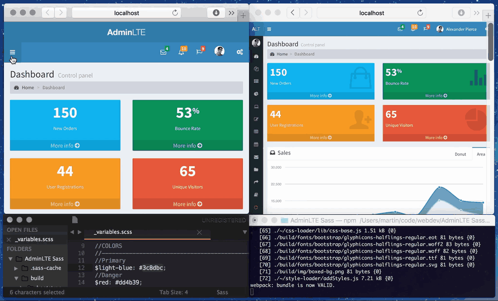

AdminLTE with Sass, Webpack, Browser-Sync
============

AdminLTE Sass is a custom port of the AdminLTE template (see [AdminLTE by Almsaeed Studio](https://github.com/almasaeed2010/AdminLTE)) from Less to Sass. It uses a modified file structure and comes with webpack and browser-sync for faster and easier development.

### Usage

Insall the dependencies
```
npm install
```

Running the dev-server with hot/live reloading
```
npm start
```

Build the files (to ./dist folder)
```
npm run build
```

The output files will automatically get minified by webpack. To disable the minification, remove the ```UglifyJsPlugin``` in ```webpack.config.build.js```


### Preview

